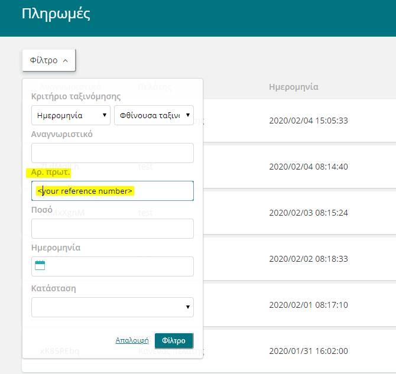
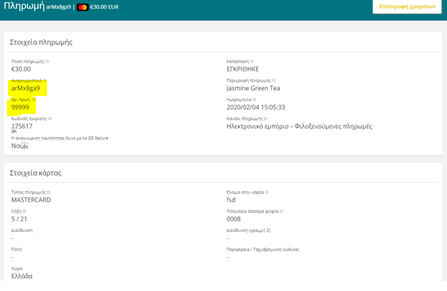

# Welcome to Simplify
## How to integrate & test

[Hosted Checkout](#Hosted-checkout)

[Direct API](#Direct-API)

[Plugins](#Plugins)

[SDKs](#Available-SDKs)


## Hosted Checkout 

Using Simplify you can have several benefits. The Simplify platform is available for the merchants of NBG Simplify system and is a platform you will can to manage your websites's transactions. After becoming a member, you will receive an automated mail from the platform. After this, you will be able to define your password and answer few security questions for the Simplify platform. Your account becomes valid with your credentials. So, you can log in with your credentials (your email and your password) on the link [here](https://ibanknbg.uat.simplify.com/commerce/login/auth).

Regarding the way that you can hosted payments into your website, there are two easy ways in which you can start to use hosted payments on your website. You have the option of presenting the hosted payment form as either a modal or embedding it directly on your page.

The checkout is fully hosted, compliant with updated PCI standards and requires no server-side scripting. Your first option is to add a modal with a button on your web site by adding the code given below and follow the instructions.

- Copy and paste the code snippet below directly into your web page, in the location where you want the button to display ( in your html file).

```
	<script type="text/javascript"
	        src="https://www.simplify.com/commerce/simplify.pay.js"></script>
	<button data-sc-key="YOUR_HOSTED_PAYMENTS_ENABLED_PUBLIC_KEY"
	        data-name="Jasmine Green Tea"
	        data-description="Smooth tea with a rich jasmine bouquet"
	        data-reference="99999"
	        data-amount="3000"
	        data-color="#12B830">
	        Buy Now
	</button>

```

- Change the value of the &#39;&#39;data-sc-key&#39;&#39; attribute to your own hosted public key. This public key exists on the platform Account Settings / API keys / [ your hosted public key](https://ibanknbg.uat.simplify.com/commerce/docs/tools/hosted-payments#keys).
- Change the value of the &quot;data-reference&quot; attribute to your reference number for the payment.

If you put the code correctly, you can go to your website and click this button. By clicking on the button you go to the simplify checkout form.

Then try to make a payment with example number card below. This card has ACS Simulator so, you can choose different option (different test cases).

Your second option is to put an embedded form in you web page by adding the second code given.
```
	<script type="text/javascript"
	        src="https://www.simplify.com/commerce/simplify.pay.js"></script>
	<iframe name="my-hosted-form"
	        data-sc-key="YOUR_HOSTED_PAYMENTS_ENABLED_PUBLIC_KEY"
	        data-name="Jasmine Green Tea"
	        data-description="Smooth tea with a rich jasmine bouquet"
	        data-reference="99999"
	        data-amount="3000"
	        data-color="#12B830">
	</iframe>
```

The only difference is the "iframe" instead of "button" in a modal (in html file). In the same way, follow the instructions below.

- Copy and paste the code snippet below directly into your web page, in the location where you want the button to display (in your html file).
- Change the value of the &#39;&#39;data-sc-key&#39;&#39; attribute to your own hosted public key. This public key exists on the platform Account Settings / API keys / [your hosted public key](https://ibanknbg.uat.simplify.com/commerce/docs/tools/hosted-payments#keys).
- Change the value of the &quot;data-reference&quot; attribute to your reference number for the payment

Now, it is displayed the form direct on your page.

**Simple example html file (modal)**
```
<!DOCTYPE html>
<html>
<head>
    <title></title>
</head>
<body>
<script type="text/javascript"                  
src="https://uat.simplify.com/commerce/simplify.pay.js"></script>                   
<button data-sc-key="="your live api key goes here ""                 
data-name="Jasmine Green Tea"                   
data-description="Smooth tea with a rich jasmine bouquet"                   
data-reference="99999"                  
data-amount="3000"                  
data-color="#12B830">                   
Buy Now                 
</button>
</body>
</html>
```
**Modal Redirect URL**

Use the redirect URL to return your customers back to your website with the response parameters returned in the query string. This option is ideal for websites that do not use HTTPS.

```
<script type="text/javascript" src="https://www.uat.simplify.com/commerce/simplify.pay.js"></script>
<button data-sc-key="YOUR_HOSTED_PAYMENTS_ENABLED_PUBLIC_KEY"
        data-name="Jasmine Green Tea"
        data-description="Smooth tea with a rich jasmine bouquet"
        data-reference="99999"
        data-amount="3000"
        data-color="#12B830"
        data-redirect-url="https://www.example.com/checkout.html">
        Buy Now
</button>
```

More about modal redirect url [here](https://ibanknbg.uat.simplify.com/commerce/docs/tools/hosted-payments#redirect-url) .

You can find Information about handling responses [here](https://ibanknbg.uat.simplify.com/commerce/docs/tools/hosted-payments#js).

Choose one option and follow the instructions for 5 scenarios with the example number card below. It&#39;s important for each transaction you fill in the data reference in the table below.

! Note: For each transaction you have to change the &quot;data-reference&quot; and then you try to do the payment. After payment add the data-reference in the table.

For more information about Hosted Checkout please visit this [documentation](https://ibanknbg.uat.simplify.com/commerce/docs/tools/hosted-payments).

**Example number card**

Correct Card Details:

Number_card: 5123450000000008  , 3Ds: yes , CVC: 100  , Exp. Date: 05/21

| Transaction | Card Number | ACS Simulator | Expected Result | Input Data | Test Case | Data  Reference |  ID  |
| --- | --- | --- | --- | --- | --- | --- | --- |
| Auth/Pre | 5123450000000008 |  Authenticated | ACCEPTED | Correct Data | 3D-Secure Authenticated |   |   |
| Auth/Pre | 5123450000000008 |  NotAuthenticated | DECLINED | Correct Data | Not 3D-Secure Authenticated |   |   |
| Auth/Pre | 5123450000000008 |   Attempted | ACCEPTED | Correct Data | 3D-Secure Attempted |   |   |
| Auth/Pre | 5123450000000008 |   Unavailable | ACCEPTED | Correct Data | 3D-Secure Unavailable |   |   |
| Auth/Pre | 5123450000000008 |  Authenticated | DECLINED | Wrong CVV (example 102) | 3D-Secure Authenticated |   |   |

**Scenario 1:** Successful transaction with 3DS authentication successful.

Enter the card details and all other required details for the transaction. In the following 3DS emulator choose &quot;Authentication successful&quot; and press &quot;Submit&quot;. The payment should be completed successfully.

**Scenario 2:** _Transaction with 3DS authentication failure._

Enter all required details as before. In the following 3DS emulator choose &quot;Authentication failed&quot; and press &quot;Submit&quot;.The payment should be declined.

**Scenario 3:** _Successful transaction with 3DS authentication attempted._

Enter all required details as before. In the following 3DS emulator choose &quot;Authentication Attempted&quot; and press &quot;Submit&quot;. The payment should be completed successfully.

**Scenario 4:** _Successful transaction with 3DS authentication unavailable_

Enter all required details as before. In the following 3DS emulator choose &quot;Authentication Not Available&quot; and press &quot;Submit&quot;. The payment should be successful.

**Scenario 5:** Failed _transaction using a wrong CVC number with 3DS authentication successful._

Enter all required details as before, but with an invalid CVC number, 102 instead of 100 in this test case. In the following 3DS emulator choose &quot;Authentication Successful&quot; and press &quot;Submit&quot;.The payment should be declined.

After all these scenarios, you can confirm the result from the merchant administrator page using the &quot;data-reference&quot; into the Simplify platform / Transaction / Payments / filter by reference.

 

After finding the transaction you can see the details payments. When you find the payment with your &quot;data reference&quot; you can note the &quot;ID&quot; value in the table, too.

 

After filling in the data reference and the ID for each scenario, you have to send us the updated table.

### Direct API 
The Direct API Integration enables merchants to process credit card and check transactions in real time directly through ecommerce solution. In below link you can find the API calls that you can use with instructions.

[Direct API Calls instructions](https://ibanknbg.uat.simplify.com/commerce/docs/api/index?api=payments)


### Plugins 
You have the option to use popular e-commerce plugins. A software plug-in is an add-on for a program that adds functionality to it. Below is a link of plugins and extensions with which you can integrate. 

[Plugins instructions](https://ibanknbg.uat.simplify.com/commerce/docs/plugins/index)

### Available SDKs
SDK (software development kit) is a set of software tools and programs used by developers to create applications for specific platforms. Below is a list of programming languages we provide support to develop with.  
Java, php, Ruby, Python Pelr, .net, node.js, ios, android

[SDKs instructions](https://ibanknbg.uat.simplify.com/commerce/docs/sdk/index)
