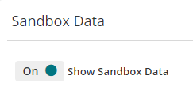
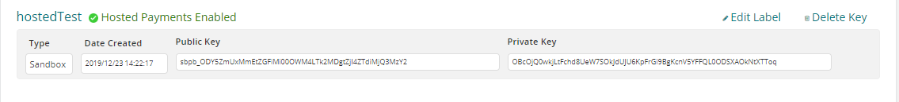
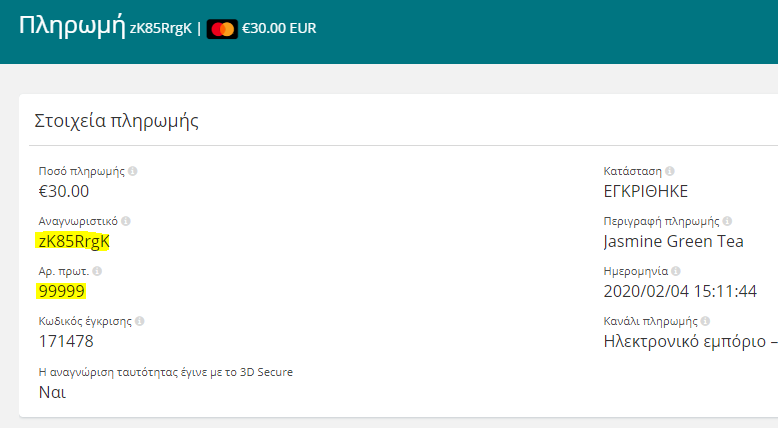

# Welcome to Simplify
## How to integrate & test


[Hosted Checkout](#Hosted-checkout)

[Hosted Chechout test only for Sandbox mode](#Hosted-Chechout-test-only-for-Sandbox-mode)

[Direct API](#Direct-API)

[Plugins](#Plugins)

[SDKs](#Available-SDKs)

## Testing Modes

The i-bank my Store API can be accessed in Sandbox or Live modes. In Sandbox mode, all payments are simulated. In Live mode, payments are real. The API key specified in API requests determines which mode is accessed. When logged into the i-bank my Store web portal, you can switch between viewing Sandbox and Live data using the toggle switch in the header.


## Live
When used for live payments (e.g. when configured with a live API key), the hosted payment button will only work on the website that is registered in your live i-bank my Store account. 

## SandBox
Sandbox environment is comprised of virtual servers for software testing in an isolated environment that developers use to test new features. Using sandbox you cannot use 3Ds enrolled cards and plugins. Additionally, the redirect url is disabled when using a sandbox key for testing.

## Hosted Checkout 

There are two easy ways in which you can start to use hosted payments on your website. You have the option of presenting the hosted payment form as either a modal or embedding it directly on your page.

The checkout is fully hosted, compliant with updated PCI standards and requires no server-side scripting. Your first option is to add a modal with a button on your web site by adding the code given below and following the instructions.

### Simple example html file for live and sandbox environment (modal)


```
<!DOCTYPE html>
<html>
<head>
    <title></title>
</head>
<body>
<script type="text/javascript"                  
src="https://simplify.com/commerce/simplify.pay.js"></script>                   
<button data-sc-key="<put your Api public hosted key>"                 
data-name="Jasmine Green Tea"                   
data-description="Smooth tea with a rich jasmine bouquet"                   
data-reference="99999"                  
data-amount="3000"                  
data-color="#12B830">                   
Buy Now                 
</button>
</body>
</html>
```
Your second option is to put an embedded form in your web page by adding the second code given.

### Simple example html file for live and sandbox environment (embedded form)
```
	<script type="text/javascript"
	        src="https://www.simplify.com/commerce/simplify.pay.js"></script>
	<iframe name="my-hosted-form"
	        data-sc-key="<put here your Api public hosted api key>"
	        data-name="Jasmine Green Tea"
	        data-description="Smooth tea with a rich jasmine bouquet"
	        data-reference="99999"
	        data-amount="3000"
	        data-color="#12B830">
	</iframe>
```

The only difference is the "iframe" instead of "button" in a modal (in html file). In the same way, follow the instructions below.

### Instructions
- Copy and paste the code snippet below directly into your web page, in the location where you want the button to display (in your html file).
- Change the value of the &#39;&#39;data-sc-key&#39;&#39; attribute to your own hosted public key (live or sandbox). This public key exists on the platform Account Settings / API keys / [your hosted public key](https://ibanknbg.simplify.com/commerce/docs/tools/hosted-payments#keys)(only for live mode).
- Change the value of the &quot;data-reference&quot; attribute to your reference number for the payment.

In **sandbox** enviroment you can put the sandbox hosted public key that was provided through the developers portal and use these [test Cards](https://ibanknbg.simplify.com/commerce/docs/testing/test-card-numbers).

## Card Tokenization

There are 2 types of operations permitted when configuring your hosted payments page: **create.token** and **create.payment**. The default operation when building your button or iframe without explicitly defining an operation type e.g data-operation='create.payment'. Furthermore, the configuration option e.g.data-operation=*'create.token'* is used to tokenize the credit card details entered by a user on the hosted payment form. This operation provides you with greater control over the payment experience. However, you need to download one of i-bank my Store's [SDKs](https://ibanknbg.simplify.com/commerce/docs/sdk/index) and complete the payment on the server. So, if you want to generate a card token, you can use the code below for **Live or Sandbox environment**.

### Simple example html file (modal)

```
<!DOCTYPE html>
<html>
<head>
    <title></title>
</head>
<body>
<script type="text/javascript"                  
src="https://simplify.com/commerce/simplify.pay.js"></script>                   
<button data-sc-key="<your public hosted Live or Sandbox key>"                 
data-name="Jasmine Green Tea"                   
data-description="Smooth tea with a rich jasmine bouquet"                   
data-reference="99999"                  
data-amount="3000"        
data-operation="create.token"        
data-color="#12B830">                   
Buy Now                 
</button>
</body>
</html>

```

After payment you can confirm that token is genberated.  **create.token** will return a card token in the response. It will not result in a payment. The card token can be used with our API to create a payment or save the card to a customer.


## Troubleshooting
If hosted payments doesn't work straight away, below is a checklist that may help you get up and running.

- Use a Hosted Payment Enabled API Key: If you plan on using the form to make payments, then you need to use the right key.
- Use the Public Key: So you enabled an API Key Pair for hosted payments, but it still doesn't work. There are 2 keys, so make sure it is the public key that is used. Public keys start with sbpb_ (sandbox/test key) or lvpb_ (live key). For **sandbox** testing the [keys](https://nbgfilestorage.blob.core.windows.net/ecommerce/docs/i-Bank%20e-Simplify%20Sandbox%20Credentials.docx) are provided through the developers portal.
- Use the Correct Website: You have successfully tested your hosted payments locally and now have switched to a live key. As a security measure, hosted payments will only work on the website you registered with Simplify.com when you onboarded. See [Domain Restrictions](https://ibanknbg.simplify.com/commerce/docs/tools/hosted-payments#domain).

### Handling responses

**Modal Redirect URL** (only for live mode)

Use the redirect URL to return your customers back to your website with the response parameters returned in the query string. So If set, this will be the URL your customers will be returned to once the payment transaction is complete. In live mode the domain of the redirect URL must be on the same domain as the website you registered when onboarding with i-bank my Store.
This option is ideal for websites that do not use HTTPS.

```
<script type="text/javascript" src="https://www.simplify.com/commerce/simplify.pay.js"></script>
<button data-sc-key="<put here your live public hosted api key>"
        data-name="Jasmine Green Tea"
        data-description="Smooth tea with a rich jasmine bouquet"
        data-reference="99999"
        data-amount="3000"
        data-color="#12B830"
        data-redirect-url="https://www.example.com/checkout.html">
        Buy Now
</button>
```
More about modal redirect url [here](https://ibanknbg.simplify.com/commerce/docs/tools/hosted-payments#redirect-url) .

You can find more information about handling responses [here](https://ibanknbg.simplify.com/commerce/docs/tools/hosted-payments#js).


# Hosted Chechout test only for Sandbox mode

In Sandbox mode, first of all you must confirm the automated i bank simplify email and generate your password. After you login with you credentials, you are able to use the platform.
For testing in Sandbox mode you have to do enable the sandbox data (Account settings -> Account settings -> Show Sandbox data ON) and you have to generate your hosted **public** Sandbox key as the picture below. Account settings -> API keys.




Then you have to use the html code [Simple example html file for live and sandbox environment (modal)](#simple-example-html-file-for-live-and-sandbox-environment-modal) to make the scenarios below. Follow the [Instructions](#Instructions)

## Test Results

| Transaction | Card Number | Details Card|  Expected Result | Data  Reference |  ID  |
| --- | --- | --- | --- | --- | --- | 
| Authorization/Pay| 2222 4053 4324 8877  | 05/21  100 | ACCEPTED |   |   |
| Authorization/Pay| 5555 5555 5555 7462  | 05/21  100 | DECLINED |   |   |


Scenarios 1 : Successful transaction. The status must be "APPROVED"

Scenarios 2 : Failed transaction. The status must be "DECLINED".

! Note: For each transaction you have to change the &quot;data-reference&quot; and then you try to do the payment. After payment add the data-reference in the table. [Download the table](https://nbgfilestorage.blob.core.windows.net/ecommerce/docs/Test%20Results.docx).

For more information about Hosted Checkout please visit this [documentation](https://ibanknbg.simplify.com/commerce/docs/tools/hosted-payments).

After all these scenarios, you can confirm the result from the merchant administrator page using the &quot;data-reference&quot; into the Simplify platform / Transaction / Payments / filter by reference.


After finding the transaction you can see the details payments. When you find the payment with your &quot;data reference&quot; you can note the &quot;ID&quot; value in the table, too.

 

After filling in the data reference and the ID for each scenario, you have to send us the updated table.


### Direct API 

Another option to integrate is direct API. The Direct API Integration enables merchants to process credit card and check transactions in real time directly through ecommerce solution. To use direct API calls you have to download first the SDK from [here](https://ibanknbg.simplify.com/commerce/docs/sdk/index). Also, in this case you have to use the (default) public API key (Live or SandBox). In below link you can find the API calls that you can use with instructions. Each section of our API includes detailed information about methods & parameters as well as example code.

[Direct API Calls instructions](https://ibanknbg.simplify.com/commerce/docs/api/index?api=payments)

### Plugins (not appliccable in sandbox environment) 

You have the option to use popular e-commerce plugins. A software plug-in is an add-on for a program that adds functionality to it. It is mentioned that plugins are enabled for Live mode only. Below is a link of plugins and extensions with which you can integrate. 

[Plugins instructions](https://ibanknbg.simplify.com/commerce/docs/plugins/index)

### Available SDKs
SDK (software development kit) is a set of software tools and programs used by developers to create applications for specific platforms. Below is a list of programming languages we provide support to develop with.  
Java, php, Ruby, Python Pelr, .net, node.js, ios, android

[SDKs instructions](https://ibanknbg.simplify.com/commerce/docs/sdk/index)
